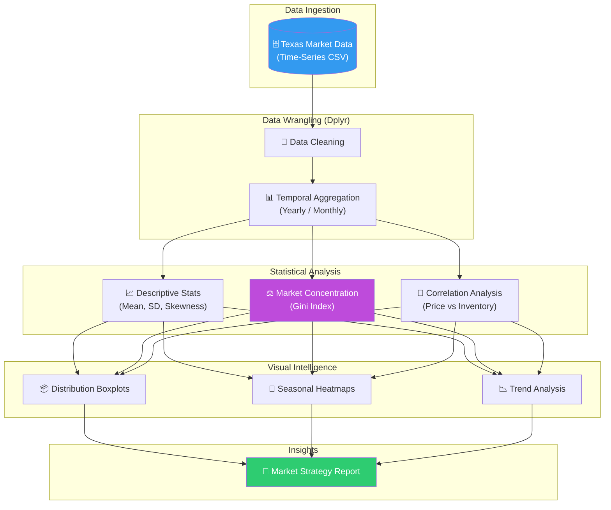
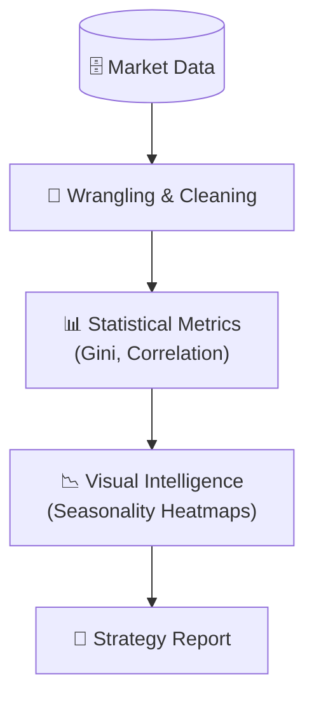

# 🏘️ TexasRealty: Strategic Market Intelligence & Economic Time-Series Analysis

<p align="center">
  
  
  
  
  
</p>

**TexasRealty** è un progetto di Market Intelligence avanzata focalizzato sull'analisi quantitativa del mercato immobiliare texano. Utilizzando il linguaggio **R**, il progetto implementa una pipeline di analisi esplorativa (EDA) e statistica descrittiva per estrarre insight strategici su dinamiche di prezzo, stagionalità e concentrazione di mercato. Le metodologie applicate sono direttamente trasferibili a scenari di Energy Pricing, Demand Forecasting e analisi macroeconomiche.

## 🏢 Valore Enterprise & Settori di Applicazione

| Settore / Ambito | Rilevanza & Benefici |
|-------------------|-----------|
| **Real Estate & PropTech** | Analisi dei trend di mercato, valutazione degli asset e supporto al posizionamento strategico dei portafogli immobiliari. |
| **Financial Services & Banking** | Valutazione del rischio di mercato, analisi delle garanzie collaterali e monitoraggio delle bolle speculative regionali. |
| **Energy & Utilities** | Applicazione di modelli di stagionalità e variabilità per il forecasting della domanda e l'ottimizzazione del pricing dinamico. |
| **Retail Expansion** | Supporto alla selezione dei siti (Site Selection) basato sulla densità delle vendite e sulla stabilità dei prezzi locali. |

---

## 🎯 Executive Summary & Valore di Business
TexasRealty trasforma dataset di mercato grezzi in una base di conoscenza strutturata per supportare decisioni d'investimento e piani industriali.

### 🏛️ 1. Analisi delle Dinamiche Macroeconomiche
* **Indice di Gini e Concentrazione:** Implementazione dell'Indice di Gini tramite il pacchetto `ineq` per quantificare la disparità nella distribuzione delle vendite tra le diverse città, identificando hub dominanti e mercati emergenti.
* **Correlazione Prezzo-Inventario:** Quantificazione del legame inverso tra scorte e prezzi (Pearson r ≈ -0.61), fornendo un indicatore solido della pressione della domanda.

### ⚙️ 2. Analisi delle Serie Temporali e Stagionalità
* **Trend Stagionali:** Identificazione dei picchi operativi (maggio-luglio) e dei periodi di contrazione (gennaio-febbraio), permettendo l'ottimizzazione del timing per campagne marketing e lanci di prodotto.
* **Asimmetria e Variabilità:** Analisi della Skewness e del Coefficiente di Variazione (CV) per valutare la volatilità del mercato, distinguendo tra stabilità strutturale e shock temporanei.

### 🛡️ 3. Data Visualization Professionale (ggplot2)
* **Visual Storytelling:** Creazione di asset grafici complessi (boxplot, heatmap stagionali, scatter plot di regressione) che facilitano la comunicazione di insight tecnici a stakeholder non tecnici.

---

## 🏗️ Architettura del Workflow Analitico



## 🛠️ Stack Tecnologico

| Layer | Tecnologia | Ruolo |
|:------|:-----------|:-----|
| 📈 **Language** | R 4.x | Statistical Computing |
| 📊 **Visualization** | ggplot2 | Professional Data Storytelling |
| 🧹 **Data Manipulation** | dplyr | Advanced Data Wrangling |
| ⚖️ **Economics** | ineq | Concentration & Inequality Metrics |
| 📝 **Reporting** | RMarkdown | Reproducible Executive Reports |

## 🚀 Setup

```r
# Installazione pacchetti
install.packages(c("ggplot2", "dplyr", "ineq", "knitr"))

# Esecuzione dell'analisi
source("ScriptR.R")

# Rendering del report finale
rmarkdown::render("Progetto_vendite_immobiliari.Rmd")
```

<br><br>

*Progettato e sviluppato da Eugenio Pasqua.*

---

# 🇬🇧 ENGLISH VERSION

# 🏘️ TexasRealty: Strategic Market Intelligence & Economic Time-Series Analysis

<p align="center">
  
  
</p>

**TexasRealty** is an advanced market intelligence project focused on the quantitative analysis of the Texas real estate market. Using the **R** language, the project implements an exploratory analysis (EDA) and descriptive statistics pipeline to extract strategic insights into price dynamics, seasonality, and market concentration.

## 🏢 Enterprise Value & Application Sectors

| Sector / Domain | Relevance & Benefits |
|-------------------|-----------|
| **Real Estate & PropTech** | Market trend analysis, asset valuation, and strategic portfolio positioning support. |
| **Energy & Utilities** | Applying seasonality and variability models for demand forecasting and dynamic pricing optimization. |
| **Finance & Risk** | Regional speculative bubble monitoring and collateral asset analysis. |

---

## 🏗️ Analytical Workflow Architecture



## 🧰 Technology Stack

`R 4.x` · `ggplot2` · `dplyr` · `ineq` · `RMarkdown`

<br><br>

*Designed and developed by Eugenio Pasqua.*
